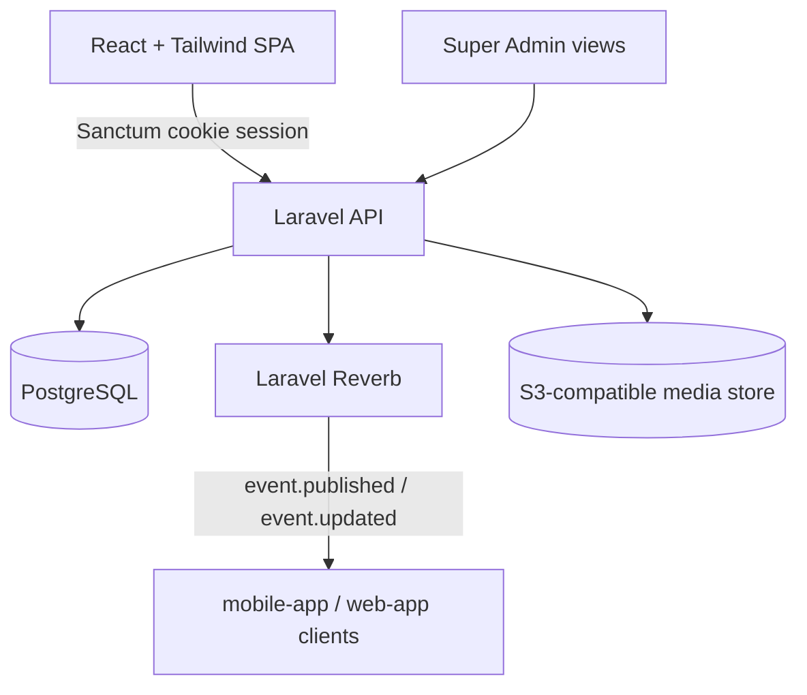

# Admin Panel Design

**Spec**: `.specs/features/admin-panel/spec.md`
**Context**: `.specs/features/admin-panel/context.md`
**Status**: Draft

---

## Architecture Overview

Admin-panel is a React + Tailwind SPA talking to the shared Laravel/PHP 8.4 API (AD-004) over its own auth guard, distinct from the consumer guard used by `mobile-app`/`web-app` (AD-002). This feature is the **write side** of most platform domain data — organizers, venues, events, promoters, and plan pricing all originate here. `mobile-app`/`web-app` and `landing-page-plans` read a subset of this data (published events, current plan price) but never write it directly.



- **Auth**: Laravel Sanctum, `organizer` guard for approved/pending/rejected organizers, separate `super_admin` guard. Session delivered as an HttpOnly/Secure/SameSite cookie (AD-008) — no token in localStorage.
- **Authorization**: every organizer-scoped endpoint (events, venue, promoters, price history reads) is checked through a Laravel Policy against the authenticated organizer's `id`, never trusting a route-supplied ID alone (AD-008 IDOR guardrail).
- **Real-time**: publishing/updating/cancelling an event broadcasts an `EventPublished`/`EventUpdated`/`EventCancelled` event over Reverb on a public `events` channel, consumed by `mobile-app`/`web-app` (MOBILE-02/WEB-02).
- **Layering (AD-012, Clean Architecture)**: `backend/app/Domain/{Entities,Contracts}` (framework-agnostic entities + repository interfaces; the event status-transition rules, ownership rules, and the Basic-tier cap rule live here with no Eloquent/HTTP dependency) → `backend/app/Application/{UseCases/<Feature>,Services,Policies}` (one use-case per action, e.g. `PublishEvent`, `ApproveOrganizer`; `PublishedEventCounter` and every Policy live here) → `backend/app/Infrastructure/Persistence/Eloquent/{<Entity>Model.php,Eloquent<Entity>Repository.php}` (the concrete Eloquent-backed implementation of each `Domain/Contracts` interface) → `backend/app/Presentation/Http/Controllers/...` (thin controllers calling Application use-cases only, no direct Eloquent queries or business logic).

---

## Data Models

```typescript
interface Organizer {
  id: string
  orgName: string
  contactName: string
  email: string          // unique
  phone: string
  passwordHash: string
  planTier: "basic" | "plus"
  approvalState: "pending" | "approved" | "rejected"
  rejectionReason: string | null
  consentGivenAt: Date    // captured at landing-page-plans signup (PLAN-12)
  createdAt: Date
  deletedAt: Date | null  // LGPD soft-delete marker (ADMIN-25)
}

interface Venue {
  id: string
  organizerId: string     // FK -> Organizer, one venue per organizer (per current spec scope)
  name: string
  description: string
  address: string
  contactInfo: string
  imageUrl: string | null
}

interface Event {
  id: string
  organizerId: string     // FK -> Organizer
  venueId: string         // FK -> Venue
  title: string
  description: string
  dateTime: Date
  location: string
  fullAddress: string
  featuredImageUrl: string
  externalTicketLink: string
  priceType: "free" | "paid"
  musicCategory: string
  capacity: number | null
  ageRange: string | null
  additionalInfo: string | null
  accessibilityInfo: string | null
  eventRules: string | null
  status: "draft" | "published" | "cancelled" | "closed"
  publishedAt: Date | null   // used to compute the Basic-tier monthly count (ADMIN-28)
  createdAt: Date
}

interface Promoter {
  id: string
  organizerId: string     // FK -> Organizer
  name: string
  phone: string
  email: string
  instagramUrl: string
  tiktokUrl: string
}

interface EventPromoter {
  eventId: string          // FK -> Event
  promoterId: string       // FK -> Promoter
}

interface PlanPrice {
  id: string
  tier: "plus"              // extensible if more paid tiers are added later
  amount: number             // BRL, integer cents
  effectiveFrom: Date
  effectiveTo: Date | null   // null = current price
  setBySuperAdminId: string
}

interface DataExportRequest {
  id: string
  organizerId: string
  status: "pending" | "ready" | "failed"
  downloadUrl: string | null
  requestedAt: Date
}
```

**Relationships**: `Organizer 1—1 Venue` (current scope), `Organizer 1—N Event`, `Organizer 1—N Promoter`, `Event N—N Promoter` via `EventPromoter`, `PlanPrice` is append-only (never updated in place — a new row per price change, closing the previous row's `effectiveTo`).

---

## Components

### OrganizerApprovalController / SuperAdminOrganizerPolicy

- **Purpose**: List pending organizers, approve/reject, enforce Super-Admin-only access (ADMIN-01..05).
- **Location**: `backend/app/Presentation/Http/Controllers/SuperAdmin/OrganizerApprovalController.php` (Presentation) → `backend/app/Application/UseCases/OrganizerApproval/{ListPendingOrganizers,ApproveOrganizer,RejectOrganizer}.php` (Application) → `backend/app/Domain/Contracts/OrganizerRepositoryInterface.php` (Domain) implemented by `backend/app/Infrastructure/Persistence/Eloquent/EloquentOrganizerRepository.php` (Infrastructure)
- **Interfaces**: `GET /super-admin/organizers?state=pending`, `POST /super-admin/organizers/{id}/approve`, `POST /super-admin/organizers/{id}/reject`
- **Dependencies**: `super_admin` guard, forces re-authentication on next login after a mid-session approval (Edge Case in spec).

### EventController / EventPolicy

- **Purpose**: CRUD + status transitions for an organizer's own events, including the Basic-tier monthly cap check (ADMIN-06..10, ADMIN-28).
- **Location**: `backend/app/Presentation/Http/Controllers/Organizer/EventController.php` (Presentation) → `backend/app/Application/UseCases/Event/{CreateEvent,UpdateEvent,DeleteEvent,DuplicateEvent,TransitionEventStatus}.php` + `backend/app/Application/Policies/EventPolicy.php` (Application) → `backend/app/Domain/Contracts/EventRepositoryInterface.php` + `backend/app/Domain/Entities/Event.php` (Domain, holds the status-transition whitelist as a pure rule) implemented by `backend/app/Infrastructure/Persistence/Eloquent/EloquentEventRepository.php` (Infrastructure)
- **Interfaces**: `POST /organizer/events`, `PUT /organizer/events/{id}`, `POST /organizer/events/{id}/duplicate`, `DELETE /organizer/events/{id}`, `POST /organizer/events/{id}/status`
- **Dependencies**: `PublishedEventCounter` service (counts an organizer's `published` transitions within the current calendar month; only enforced when `organizer.planTier === "basic"`).

### VenueController, PromoterController

- **Purpose**: CRUD for venue presence and promoter records, and linking promoters to events (ADMIN-13/14, ADMIN-17..19).
- **Location**: `backend/app/Presentation/Http/Controllers/Organizer/{Venue,Promoter}Controller.php` (Presentation) → `backend/app/Application/UseCases/{Venue,Promoter}/...` (Application) → `backend/app/Domain/Contracts/{Venue,Promoter}RepositoryInterface.php` (Domain) implemented by `backend/app/Infrastructure/Persistence/Eloquent/Eloquent{Venue,Promoter}Repository.php` (Infrastructure)

### EngagementDashboardController

- **Purpose**: Per-event and aggregate stats (views, favorites, ticket-link clicks, interest count) — ADMIN-11/12.
- **Location**: `backend/app/Presentation/Http/Controllers/Organizer/EngagementDashboardController.php` (Presentation) → `backend/app/Application/UseCases/Engagement/GetEventEngagement.php` (Application, read-only aggregation) → `backend/app/Domain/Contracts/EventStatsRepositoryInterface.php` (Domain) implemented by `backend/app/Infrastructure/Persistence/Eloquent/EloquentEventStatsRepository.php` (Infrastructure)
- **Reuses**: engagement counters are written by `mobile-app`/`web-app` API calls (favorite, click, interest) into shared `event_stats` tables; this controller only reads/aggregates.

### PlanPricingController (new, AD-006)

- **Purpose**: Super Admin sets/reads the Plus tier's current and historical price (ADMIN-20..23).
- **Location**: `backend/app/Presentation/Http/Controllers/SuperAdmin/PlanPricingController.php` (Presentation) → `backend/app/Application/UseCases/PlanPricing/{GetPlanPriceHistory,SetPlanPrice}.php` (Application) → `backend/app/Domain/Contracts/PlanPriceRepositoryInterface.php` (Domain, append-only rule lives here) implemented by `backend/app/Infrastructure/Persistence/Eloquent/EloquentPlanPriceRepository.php` (Infrastructure)
- **Interfaces**: `GET /super-admin/plan-prices`, `POST /super-admin/plan-prices` (creates a new current-price row, closes the previous one's `effectiveTo`)
- **Dependencies**: `super_admin` guard only; validated as a positive numeric amount.

### OrganizerDataController (new, AD-008)

- **Purpose**: Organizer self-service data export and account deletion, with Super Admin override (ADMIN-24..27).
- **Location**: `backend/app/Presentation/Http/Controllers/Organizer/OrganizerDataController.php` (Presentation) → `backend/app/Application/UseCases/OrganizerData/{ExportOrganizerData,DeleteOrganizerAccount}.php` (Application) → `backend/app/Domain/Contracts/{Organizer,DataExportRequest}RepositoryInterface.php` (Domain) implemented by `backend/app/Infrastructure/Persistence/Eloquent/...` (Infrastructure)
- **Interfaces**: `POST /organizer/data-export`, `POST /organizer/account/delete`
- **Dependencies**: queued export job (Laravel Queue) generating a downloadable archive from `Organizer`, `Venue`, `Event`, `Promoter` rows scoped to that organizer.

---

## Error Handling Strategy

| Error Scenario | Handling | User Impact |
| --- | --- | --- |
| Organizer edits/deletes an event they don't own | `EventPolicy::update/delete` returns 403 before the controller runs | "You don't have permission to modify this event." |
| Invalid status transition (e.g. `cancelled → published`) | Explicit transition whitelist rejects with 422 | "This status change isn't allowed." |
| Basic-tier organizer hits the 5-event/month cap | 422 with an `upgrade_required` error code | "You've reached your Basic-tier limit — upgrade to Plus to publish more events this month." |
| Super Admin submits a non-numeric/negative price | 422 validation error | "Enter a valid price greater than zero." |
| Organizer requests deletion with an upcoming published event | 409 with a confirmation-required flag; UI shows a warning modal before resubmission with `confirm: true` | Explicit warning, not a silent block |

---

## Risks & Concerns

| Concern | Location | Impact | Mitigation |
| --- | --- | --- | --- |
| Basic-tier monthly cap needs a reliable "calendar month" boundary across timezones | `PublishedEventCounter` service | Off-by-one cap enforcement near month boundaries if timezone handling is inconsistent | Store `publishedAt` in UTC; compute the cap window using the organizer's configured timezone (default: America/Sao_Paulo) consistently in one service, not duplicated logic |
| `PlanPrice` history table has no upper bound on growth | `plan_prices` table | Negligible at this scale (price changes are rare) | None needed — flagged only for completeness |
| Account deletion needs to cascade correctly across Event/Venue/Promoter without breaking already-published consumer-facing history | `OrganizerDataController::delete` | Orphaned or dangling references if cascade is incomplete | Soft-delete the organizer and cascade-hide (not hard-delete) events/venue/promoters from consumer listings; hard-delete personal fields only after the retention window (see Tech Decisions) |

> None found beyond the above.

---

## Tech Decisions

| Decision | Choice | Rationale |
| --- | --- | --- |
| Auth token delivery | Laravel Sanctum, cookie-based SPA session for this React app | Matches AD-004/AD-008 — HttpOnly cookie, not a bearer token in JS-readable storage |
| Deletion mechanism | Soft-delete + scheduled hard-delete of personal fields after a 30-day retention window | Balances LGPD's erasure right against accidental-deletion recovery and any pending consumer-facing history; 30 days is a proposed default, not user-specified — flag for confirmation |
| Price history storage | Append-only rows with `effectiveFrom`/`effectiveTo`, never `UPDATE`d in place | Directly satisfies AD-006's "never overwritten without a trace" requirement |
| Monthly event-cap scope | Counts `status → published` transitions, not draft creation | A Basic organizer can draft freely; the cap only bites at publish time, matching the spec's AC wording ("transition a 5th event to published") |

---

## Coding Conventions (AD-012, AD-013)

- **Clean Architecture, 4 layers**: every backend feature above follows Presentation → Application → Domain ← Infrastructure (arrows show the dependency direction — Presentation and Infrastructure both depend on Domain's contracts; Domain depends on nothing). The React admin-panel frontend mirrors this with `adminpanel/src/{domain,application,infrastructure,presentation}` — domain types/constants, use-case hooks, API-client repositories, and pure UI components respectively.
- **No magic numbers/strings**: the Basic-tier cap (`4`), the deletion retention window (`30` days), and every status/enum string (`pending`/`approved`/`rejected`, `draft`/`published`/`cancelled`/`closed`) are named constants in `backend/app/Domain/Constants/AdminPanelConstants.php` (backend) and `adminpanel/src/domain/constants/adminPanelConstants.ts` (frontend) — never inlined as literals at the call site.
- **One class per file** across PHP and TypeScript/TSX in this feature.
- **YAGNI**: only the use-cases/endpoints named in this document are built — no speculative CRUD beyond what ADMIN-01..28 requires.
- **No task/ticket-referencing comments in code** (AD-014) — rationale and design decisions belong in this `design.md` and in `docs/admin-panel/architecture.md`, not in code comments.

## Documentation (AD-014)

`docs/admin-panel/architecture.md` is the canonical, human-readable write-up of this feature's layering and conventions, generated/maintained during Tasks/Execute — it restates this design.md's Architecture Overview and Coding Conventions in prose for anyone browsing the `adminpanel`/`backend` source trees without `.specs/` context.

---

## Test Plan (AD-010)

- **Backend (Pest)**: feature tests per endpoint above, named `GIVEN <organizer/super-admin state> WHEN <action> THEN <outcome>`; unit tests for `PublishedEventCounter` (month-boundary edge cases) and `EventPolicy` (IDOR: organizer A cannot act on organizer B's event).
- **Web (Jest/RTL)**: component tests for the event form, status-transition UI, and the pricing-history table.
- **E2E (Playwright)**: full flow — Super Admin approves an organizer → organizer publishes an event → organizer hits the Basic cap on a 5th event → Super Admin sets a new Plus price and the change appears in history.
- **Coverage gate**: ≥80% per AD-010/AD-011.
