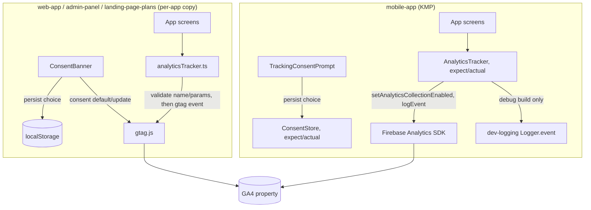

# Custom Analytics Tracking Design

**Spec**: `.specs/features/analytics-tracking/spec.md`
**Status**: Draft

---

## Architecture Overview

This feature has two settled architectural decisions confirmed with the user this session (recorded as AD-019/AD-020 in `.specs/STATE.md`), so the design below states them directly rather than re-exploring alternatives:

- **Consent mechanism — GA4 Consent Mode v2 (AD-019)**: `gtag.js` always loads on the three web apps; a per-app cookie-consent banner calls `gtag('consent', 'default', {...: 'denied'})` on load and `gtag('consent', 'update', {analytics_storage: 'granted'})` when accepted. This **supersedes** `landing-page-plans/design.md`'s original "conditionally load the GA script" approach — that file needs a follow-up amendment (flagged in Risks & Concerns below, not applied here since it belongs to a different feature).
- **Mobile SDK — Kotlin `expect`/`actual` over native Firebase SDKs (AD-020)**: no official Google KMP SDK exists (confirmed via research this session), so mobile wraps the native Android/iOS Firebase Analytics SDKs directly, mirroring `dev-logging`'s `Logger` pattern (AD-017) rather than adding a community-maintained wrapper library.

**New scope confirmed this session (AD-020)**: `web-app` and `admin-panel` get their own cookie-consent banner (new UI, since only `landing-page-plans` has one today); `mobile-app` gets a new one-time in-app tracking-consent prompt. This is real UI work, not just wiring analytics calls behind an assumed-existing gate.



---

## Code Reuse Analysis

### Existing Components to Leverage

| Component | Location | How to Use |
| --- | --- | --- |
| `dev-logging`'s KMP `Logger` (`Logger.event(tag, name, params)`) | `mobile/shared/src/commonMain/.../infrastructure/logging/Logger.kt` (LOG-11, once `dev-logging` is executed) | `AnalyticsTracker`'s `logEvent` calls `Logger.event(...)` immediately before/after the real Firebase call, satisfying ANLY-15/16 without a second logging mechanism |
| AD-008's LGPD consent-capture precedent | `.specs/STATE.md` AD-008 | The cookie-consent banner and mobile prompt follow the same "separate, explicit, timestamped choice" framing AD-008 already established for account-data consent — just a distinct choice, distinct storage key |

### Integration Points

| System | Integration Method |
| --- | --- |
| `landing-page-plans/design.md` | Needs a follow-up amendment to replace its conditional-script-load description with Consent Mode v2 (AD-019) — flagged in Risks & Concerns, not edited by this Design pass |
| AD-012 Clean Architecture layering | `ConsentBanner`/`TrackingConsentPrompt` are `Presentation`; `analyticsTracker.ts`/mobile's `AnalyticsTracker` and `ConsentStore` are `Infrastructure` |
| AD-013 no-magic-strings | Every event name and parameter key is a named constant, not an inline string literal, per app/module |

---

## Components

### ConsentBanner (website / admin / landingpage — same design, 3 independent files)

- **Purpose**: display the cookie-consent choice, persist it, and drive Consent Mode v2's `default`/`update` calls.
- **Location**: `website/src/presentation/components/ConsentBanner.tsx`, `admin/src/presentation/components/ConsentBanner.tsx`, `landingpage/src/presentation/components/ConsentBanner.tsx`
- **Interfaces**: renders with no props; internally calls `useTrackingConsent()`
- **Dependencies**: `useTrackingConsent` (below), `gtag.js` (loaded in each app's root HTML)
- **Reuses**: none — deliberately duplicated per app (AD-004)

### useTrackingConsent (website / admin / landingpage — same design, 3 independent files)

- **Purpose**: read/write the persisted consent choice and call `gtag('consent', ...)` accordingly.
- **Location**: `website/src/infrastructure/analytics/useTrackingConsent.ts` (and per-app equivalents)
- **Interfaces**: `useTrackingConsent(): { choice: 'granted' | 'denied' | 'unset', grant(): void, deny(): void }`
- **Dependencies**: `localStorage` (consent choice key), `window.gtag`
- **Reuses**: none

### analyticsTracker (website / admin / landingpage — same design, 3 independent files)

- **Purpose**: validate and fire a custom GA4 event (name/param-limit enforcement, redaction-by-construction per the spec's non-PII rule), swallowing any `gtag` failure.
- **Location**: `website/src/infrastructure/analytics/analyticsTracker.ts` (and per-app equivalents)
- **Interfaces**: `track(name: string, params: Record<string, string | number>): void`
- **Dependencies**: `useTrackingConsent`'s current choice (no-ops if not `'granted'`), `window.gtag`
- **Reuses**: none

### ConsentStore (mobile, KMP shared module)

- **Purpose**: persist the mobile tracking-consent choice on-device (survives app restarts, not re-prompted).
- **Location**: `mobile/shared/src/commonMain/.../infrastructure/analytics/ConsentStore.kt` (`expect`), `mobile/shared/src/androidMain/.../ConsentStore.android.kt` (`actual` → `SharedPreferences`), `mobile/shared/src/iosMain/.../ConsentStore.ios.kt` (`actual` → `NSUserDefaults`)
- **Interfaces**: `getChoice(): ConsentChoice`, `setChoice(choice: ConsentChoice)`
- **Dependencies**: platform-native key-value storage (no new third-party dependency, consistent with AD-020's expect/actual decision)
- **Reuses**: none

### AnalyticsTracker (mobile, KMP shared module)

- **Purpose**: wrap Firebase Analytics' `setAnalyticsCollectionEnabled`/`logEvent`, applying the same GA4 naming/size limits as web, and log every sent event through `dev-logging`'s `Logger` in debug builds.
- **Location**: `mobile/shared/src/commonMain/.../infrastructure/analytics/AnalyticsTracker.kt` (`expect`), `mobile/shared/src/androidMain/.../AnalyticsTracker.android.kt` (`actual` → `com.google.firebase.analytics.FirebaseAnalytics`), `mobile/shared/src/iosMain/.../AnalyticsTracker.ios.kt` (`actual` → Firebase iOS SDK via cinterop)
- **Interfaces**: `setCollectionEnabled(enabled: Boolean)`, `track(name: String, params: Map<String, Any>)`
- **Dependencies**: `ConsentStore` (checked before every `track` call), `dev-logging`'s `Logger.event` (debug builds only)
- **Reuses**: `dev-logging`'s `Logger` (AD-017/LOG-11)

### TrackingConsentPrompt (mobile, Presentation)

- **Purpose**: one-time in-app prompt asking the user to grant/deny tracking, shown only when `ConsentStore.getChoice()` is unset.
- **Location**: `mobile/androidApp/.../TrackingConsentPrompt.kt` (Compose), `mobile/iosApp/.../TrackingConsentPrompt.swift` (SwiftUI)
- **Interfaces**: renders with no external props; calls `ConsentStore.setChoice(...)` and `AnalyticsTracker.setCollectionEnabled(...)` on the user's choice
- **Dependencies**: `ConsentStore`, `AnalyticsTracker`
- **Reuses**: none

---

## Data Models

No persisted backend entity — every consent choice and event is client-side/on-device state or Google-side GA4 data, not a row in this platform's own database.

```typescript
type ConsentChoice = "granted" | "denied" | "unset"
```

**Relationships**: none — `ConsentChoice` is a local key-value value, not a relational entity.

---

## Error Handling Strategy

| Error Scenario | Handling | User Impact |
| --- | --- | --- |
| `gtag` script fails to load, or a `gtag('event', ...)` call throws | `analyticsTracker.track()` wraps the call in try/catch and swallows the failure | None — the triggering user action completes normally (ANLY-09) |
| Firebase Analytics SDK fails to initialize, or `logEvent` throws | `AnalyticsTracker.track()` wraps the call in try/catch and swallows the failure | None — the triggering user action completes normally (ANLY-14) |
| An event name or parameter violates GA4's limits | Rejected (name) or truncated (value) before the `gtag`/`logEvent` call is made | None — the app continues; only that event's shape is adjusted or skipped |

---

## Risks & Concerns

| Concern | Location (file:line) | Impact | Mitigation |
| --- | --- | --- | --- |
| `landing-page-plans/design.md`'s existing "GA script conditionally loaded" language (around its own file's consent-gating section) is now stale — Consent Mode v2 (AD-019) changed the mechanism | `landing-page-plans/design.md` (not yet located precisely — that feature's own file, out of this Design pass's edit scope) | A developer reading `landing-page-plans/design.md` without also reading AD-019 would implement the superseded mechanism | Flagged here explicitly; a follow-up task (in `analytics-tracking/tasks.md` or a small dedicated edit) should amend `landing-page-plans/design.md`'s text before that feature's own Execute reaches its GA-related tasks |
| Building three new consent UIs (web-app, admin-panel, mobile-app) is real net-new product surface, not just analytics plumbing | N/A — scope-level risk, not a code location | Underestimating this as "just add gtag calls" would under-scope Tasks | Already resolved as explicit new scope in AD-020; Tasks must budget real UI tasks (banner component, persistence, first-visit detection) for each app, not fold them into the tracker task |
| GA4's Consent Mode behavior when `analytics_storage` is `'denied'` still sends limited, cookieless "conversion modeling" pings automatically (a Google platform behavior, not something the app code controls) | N/A — vendor behavior, not a code location | Some cookieless GA traffic exists even pre-consent; this is Google's designed Consent Mode behavior, not a custom-event leak from this app's own code | Out of this spec's control by design — the spec's own requirements (ANLY-01..09) only govern the app's own `gtag('event', ...)` calls, not GA4's platform-level modeling pings; noted here so it isn't mistaken for a violation of ANLY-04 |

---

## Tech Decisions

| Decision | Choice | Rationale |
| --- | --- | --- |
| Mobile analytics SDK integration | `expect`/`actual` wrapping native Firebase SDKs directly (AD-020) | No official Google KMP SDK; matches `dev-logging`'s established `Logger` pattern |
| Consent-choice persistence (mobile) | Platform-native key-value storage (`SharedPreferences`/`NSUserDefaults`) via `expect`/`actual`, not a third-party multiplatform-settings library | Consistent with AD-020's "no new third-party dependency" decision |
| Web consent-choice persistence | `localStorage`, not a cookie | Simpler API for a client-only flag with no server-side need to read it; the "cookie-consent" terminology in the spec refers to the LGPD concept (tracking/cookie consent), not literally requiring an HTTP cookie |
| Per-app duplication of `ConsentBanner`/`useTrackingConsent`/`analyticsTracker` (3 copies each) | Accepted duplication, one set of files per app | No shared component library exists across `website`/`admin`/`landingpage` (AD-004); same trade-off `dev-logging`'s `devLogger` already accepted |

> Project-level decisions: AD-019 and AD-020 already record the two decisions above at the project level in `.specs/STATE.md` — no further AD needed from this table.

---

## Coding Conventions (AD-012, AD-013)

- `ConsentBanner`/`TrackingConsentPrompt` are `Presentation`; `useTrackingConsent`/`analyticsTracker`/`ConsentStore`/mobile's `AnalyticsTracker` are `Infrastructure` — no analytics logic belongs in `Domain`/`Application`.
- No magic numbers/strings: every event name (`event_view`, `favorite_added`, etc.) and parameter key is a named constant per app/module, not an inline literal at each call site.
- One class/file per component across TypeScript and Kotlin.
- No task-referencing comments (AD-014) — this `design.md` and the future `docs/*/architecture.md` "Analytics tracking" subsections are the write-up.

## Documentation (AD-014)

Each stack's own `docs/{web-app,admin-panel,landing-page-plans,mobile}/architecture.md` gains an "Analytics tracking" subsection during Tasks/Execute, alongside `dev-logging`'s "Debug logging" subsection already planned for the same files.

---

## Test Plan (AD-010)

- **Web (Jest)**: `useTrackingConsent` (persistence, default/granted/denied states), `analyticsTracker` (name/param validation, truncation, swallowed `gtag` failure), `ConsentBanner` (renders only when unset, calls consent functions on choice).
- **Mobile (`kotlin.test` + platform tests)**: `ConsentStore` (persistence round-trip), `AnalyticsTracker` (collection-enabled toggling, event validation, debug-mode `Logger.event` call, swallowed SDK failure), `TrackingConsentPrompt` (shown only when unset).
- **E2E (Playwright, per web app)**: first-visit banner appears → accept → GA4 DebugView shows an event; decline → no event fires.
- **Coverage gate**: ≥80% per AD-010/AD-011.
