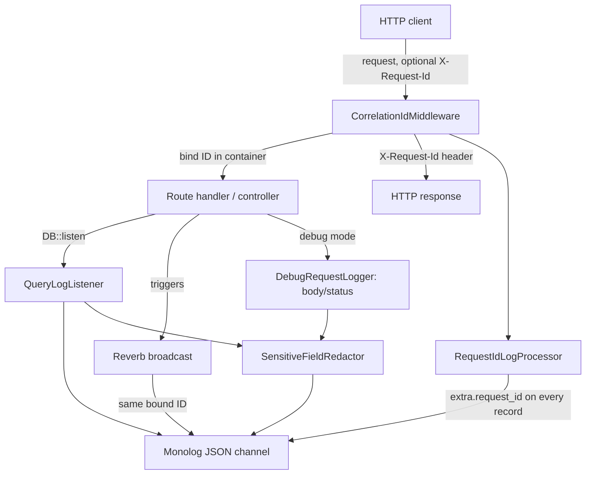

# Dev/Debug-Mode Logging Design

**Spec**: `.specs/features/dev-logging/spec.md`
**Status**: Draft

---

## Architecture Overview

There is no shared runtime across the five stacks (PHP, three independent TypeScript/Vite apps, Kotlin Multiplatform), so this feature is five independent implementations of the same *contract* — structured, debug-gated logging — not one shared library. The one piece of genuine cross-stack wiring is the `X-Request-Id` correlation header: `api` must generate/reuse it consistently and stamp it onto every log line for that request, including the Reverb broadcast it triggers.

**Approach exploration — correlation-ID propagation:**

| Approach | Description | Trade-off |
| --- | --- | --- |
| **A (recommended): middleware + container binding + Monolog processor** | A middleware resolves/generates the ID early in the request lifecycle and binds it into Laravel's per-request container; a Monolog processor reads that binding and injects `request_id` into every log record's `extra` array automatically | No business logic ever references request IDs directly — purely an Infrastructure-layer concern (AD-012). Reverb picks up the same ID for free since the broadcast dispatch runs inside the same request lifecycle, before the response is sent. |
| B: explicit parameter threading | Pass the ID as an explicit argument through every service/use-case/broadcast call that might log something | Rejected — couples unrelated Domain/Application code to a logging concern (violates AD-012's framework-agnostic layering) and requires touching every future call site as new logging points are added |

**Recommendation**: Approach A.

Web apps (`website`, `admin-panel`, `landing-page-plans`) and `mobile-app` have no cross-service correlation need (they're logging their own client-side actions, not a distributed trace), so each just needs a debug-gated logger — no middleware, no processor.

---

## Code Reuse Analysis

### Existing Components to Leverage

| Component | Location | How to Use |
| --- | --- | --- |
| `x-backend-env` anchor | `docker-compose.yml:12-33` | Add `APP_DEBUG`, `LOG_LEVEL`, `LOG_CHANNEL` here so `backend` and `reverb` share the same debug-toggle vars, consistent with how DB/Reverb/MinIO vars are already centralized in this one anchor |
| `api/.env.example` | `api/.env.example` | Add a new `# Debug logging (AD-017)` section, mirroring the file's existing per-concern grouping (App / Postgres / Reverb / MinIO / Mailhog / pgAdmin) |
| `website/.env.example`, `admin/.env.example`, `landingpage/.env.example` | same paths | No new vars needed — `import.meta.env.DEV` is a Vite build-mode flag, not something these files declare |
| `docs/development.md`, `docs/infrastructure/architecture.md` | same paths | Extend with a "Debug logging" subsection during Tasks/Execute, per AD-014 |

### Integration Points

| System | Integration Method |
| --- | --- |
| `infrastructure`'s `docker-compose.yml`/`.env.example` | This feature's `api`-side env vars slot into the existing `x-backend-env` anchor rather than duplicating a second env block |
| AD-012 Clean Architecture layering | The correlation-ID middleware, Monolog processor, and query listener are all `Infrastructure`-layer components; `Domain`/`Application` code never references `X-Request-Id` or logging directly |
| AD-008 LGPD/security baseline | The redacted-field concept reuses the same "sensitive field" framing AD-008 already established for session/PII handling — this feature doesn't invent a second sensitivity model |

---

## Components

### CorrelationIdMiddleware (api)

- **Purpose**: assign or reuse the `X-Request-Id` for the current request; bind it into the container and echo it on the response.
- **Location**: `api/app/Infrastructure/Http/Middleware/CorrelationIdMiddleware.php`
- **Interfaces**: `handle(Request $request, Closure $next): Response`
- **Dependencies**: registered globally in the HTTP kernel, runs before route middleware
- **Reuses**: none yet — first piece of `api` application code

### RequestIdLogProcessor (api)

- **Purpose**: inject the bound `X-Request-Id` into every Monolog record's `extra` array.
- **Location**: `api/app/Infrastructure/Logging/RequestIdLogProcessor.php`
- **Interfaces**: `__invoke(LogRecord $record): LogRecord`
- **Dependencies**: registered on the debug Monolog channel's processor stack in `config/logging.php`
- **Reuses**: `CorrelationIdMiddleware`'s container-bound ID

### SensitiveFieldRedactor (api)

- **Purpose**: recursively redact configured field names from a request/response body or SQL bind-parameter array before it's logged.
- **Location**: `api/app/Infrastructure/Logging/SensitiveFieldRedactor.php`
- **Interfaces**: `redact(array $data): array`
- **Dependencies**: a config array of field names (`config/logging.php` → `debug_redacted_fields`), not a hardcoded list
- **Reuses**: none

### DebugRequestLogger (api)

- **Purpose**: log request method/path/body and response status/body in debug mode, after redaction and 10 KB truncation.
- **Location**: `api/app/Infrastructure/Http/Middleware/DebugRequestLogger.php`
- **Interfaces**: `handle(Request $request, Closure $next): Response`
- **Dependencies**: `SensitiveFieldRedactor`; conditionally registered only when `APP_DEBUG=true` (a service-provider check, not an `if` inside a globally-registered middleware — zero cost in production)
- **Reuses**: `SensitiveFieldRedactor`, `CorrelationIdMiddleware`'s bound ID

### QueryLogListener (api)

- **Purpose**: subscribe to Laravel's `DB::listen()` in debug mode, redact bind parameters, write one structured log line per executed query.
- **Location**: `api/app/Infrastructure/Logging/QueryLogListener.php`
- **Interfaces**: `handle(QueryExecuted $event): void`
- **Dependencies**: `SensitiveFieldRedactor`; registered only when `APP_DEBUG=true`
- **Reuses**: `SensitiveFieldRedactor`

### devLogger (website / admin-panel / landing-page-plans — same design, 3 independent files)

- **Purpose**: thin wrapper around `console.*`, gated by `import.meta.env.DEV`, prefixed with the app's name.
- **Location**: `website/src/infrastructure/logging/devLogger.ts`, `admin/src/infrastructure/logging/devLogger.ts`, `landingpage/src/infrastructure/logging/devLogger.ts`
- **Interfaces**: `debug(...args: unknown[]): void`, `info(...args)`, `warn(...args)`, `error(...args)`
- **Dependencies**: Vite's `import.meta.env.DEV`
- **Reuses**: none — deliberately duplicated per app (AD-004's "each its own app" decision means no shared component library exists to house one copy)

### Logger (mobile, KMP shared module)

- **Purpose**: debug-build-only plain and structured (`event`) logging, backed by each platform's native debug console.
- **Location**: `mobile/shared/src/commonMain/.../infrastructure/logging/Logger.kt` (`expect`), `mobile/shared/src/androidMain/.../Logger.android.kt` (`actual` → Logcat), `mobile/shared/src/iosMain/.../Logger.ios.kt` (`actual` → `os_log`/`NSLog`)
- **Interfaces**: `d(tag: String, message: String)`, `event(tag: String, name: String, params: Map<String, Any>)`
- **Dependencies**: Kotlin's `expect`/`actual` mechanism; a compile-time debug/release check per platform for the no-op release path
- **Reuses**: none yet — first piece of mobile application code; this component is itself a dependency `analytics-tracking` (AD-018 / ANLY-10) reuses

---

## Error Handling Strategy

| Error Scenario | Handling | User Impact |
| --- | --- | --- |
| Logging sink fails to write (disk/IO error) | Every write is wrapped in a try/catch (api) or is inherently non-throwing (console/Logcat/os_log calls don't throw) | None — the triggering request/action completes normally (LOG-13) |
| Malformed (non-UUID) `X-Request-Id` from a client | Accepted and logged as-is, no validation rejection | None — request proceeds normally |
| Request/response body exceeds 10 KB | Truncated with a `"...[truncated]"` marker before logging | None — only the log line is affected, not the response actually sent |

---

## Risks & Concerns

| Concern | Location (file:line) | Impact | Mitigation |
| --- | --- | --- | --- |
| Sensitive-field redaction is a fixed, hand-maintained list (`password`/`token`/`secret`/`api_key`/`authorization`) | Future `api/config/logging.php` → `debug_redacted_fields` (not yet created — Tasks phase) | A new endpoint introducing a differently-named sensitive field (e.g. a CPF/PIX key, per LGPD's Brazilian data-field context) ships unredacted in debug logs until someone adds it | Config-driven list, not hardcoded — a one-line addition, not a code change; already flagged unconfirmed in `spec.md`'s Assumptions table. Tasks should seed the list from every sensitive field actually named across the four platform specs' data models, not just the generic auth fields listed today |
| Debug-mode SQL/body logging, if left on in a shared/staging environment reachable by multiple developers, would log other users' request bodies to a shared log stream | N/A — behavioral risk, not a code location | Potential PII exposure in a non-production but multi-user environment | `APP_DEBUG` must default to `false`/absent in every `.env.example` (true today — `api/.env.example` has no `APP_DEBUG` line, so Laravel's own default of `false` applies); Tasks must keep it that way rather than defaulting `.env.example` to `true` for developer convenience |

---

## Tech Decisions

| Decision | Choice | Rationale |
| --- | --- | --- |
| Correlation-ID propagation mechanism | Middleware + container binding + Monolog processor (Approach A above) | Keeps `Domain`/`Application` layers framework-agnostic (AD-012) |
| Redacted-field list storage | Config array (`config/logging.php`), not a hardcoded constant | Extendable without a code change, per the spec's own "list may grow" assumption |
| Debug-mode middleware registration | Conditionally bound in a service provider based on `APP_DEBUG`, not an `if` inside an always-registered middleware | Zero runtime cost in production — the middleware isn't in the pipeline at all when `APP_DEBUG=false` |
| Web apps' `devLogger` duplication (3 copies) | Accepted duplication, one file per app | No shared component library exists across `website`/`admin`/`landingpage` (AD-004); introducing one for an 8-line utility isn't justified |

> Project-level decisions: the correlation-ID mechanism and config-driven redaction are feature-local implementation choices already covered by AD-017's Decision text in `.specs/STATE.md` — no new AD needed.

---

## Coding Conventions (AD-012, AD-013)

- Every new component above lives in its stack's `Infrastructure` layer — none of this feature's logic belongs in `Domain`/`Application`/`Presentation`.
- No magic numbers/strings: the 10 KB truncation bound and the redacted-field list are named constants/config, never inlined at call sites.
- One class per file across PHP, TypeScript, and Kotlin.
- No task-referencing comments (AD-014) — this `design.md` and the future `docs/*/architecture.md` "Debug logging" subsections are the write-up.

## Documentation (AD-014)

Each stack's own `docs/{backend,web-app,admin-panel,landing-page-plans,mobile}/architecture.md` gains a "Debug logging" subsection during Tasks/Execute; `docs/infrastructure/architecture.md` gains the new `.env.example`/`docker-compose.yml` vars.

---

## Test Plan (AD-010)

- **api (Pest)**: `CorrelationIdMiddleware` (generates when absent, reuses when present), `RequestIdLogProcessor` (record carries the bound ID), `SensitiveFieldRedactor` (nested-key redaction, case-insensitivity), `DebugRequestLogger` (body truncation; `APP_DEBUG=false` produces no debug log line), `QueryLogListener` (redacts bind parameters).
- **Web (Jest)**: `devLogger`'s DEV/no-op behavior, once per app.
- **Mobile (`kotlin.test` + platform tests)**: `Logger`'s debug/release no-op behavior, `event()`'s structured output shape.
- **Coverage gate**: ≥80% per AD-010/AD-011.
