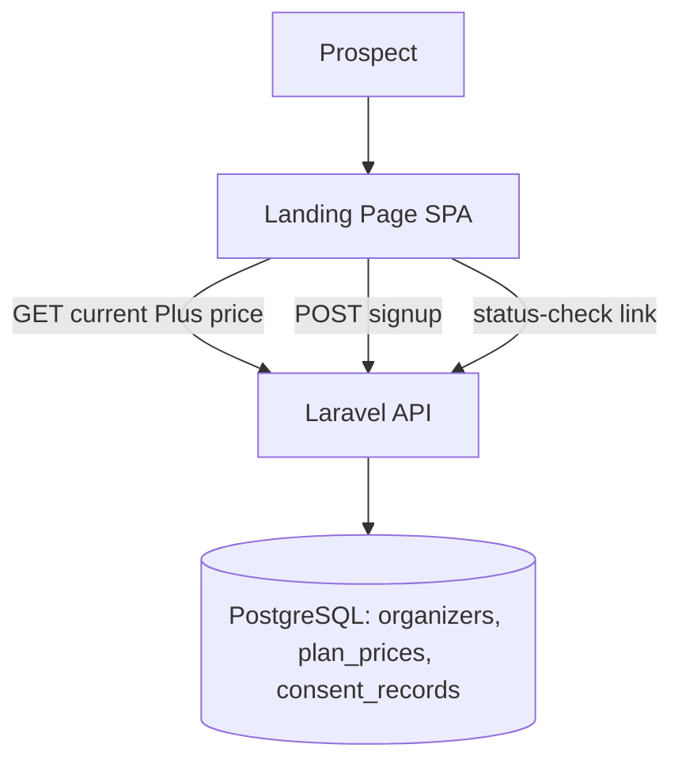

# Landing Page & Plans Design

**Spec**: `.specs/features/landing-page-plans/spec.md`
**Context**: `.specs/features/landing-page-plans/context.md`
**Status**: Draft

---

## Architecture Overview

A public, unauthenticated React + Tailwind app (its own submodule, `landingpage`) that reads the current Plus price from the shared Laravel API and writes exactly one thing: a new `Organizer` row in `pending` state (owned by `admin-panel`'s data model). No session/auth guard applies to this app itself — signup is a single unauthenticated POST.



- **Data ownership**: this feature never owns `Organizer`, `PlanPrice`, or `Event` — it's a client of admin-panel's data model (see `admin-panel/design.md`). It owns only the signup-form UX and the public price-comparison read.
- **Security**: signup is rate-limited (Laravel's built-in throttle middleware) to blunt automated pending-account spam, since this is the platform's only unauthenticated write endpoint.
- **Layering (AD-012, Clean Architecture)**: the public backend endpoints (`PlanPriceController`, `OrganizerSignupController`, `OrganizerStatusController`) follow the same 4-layer split as admin-panel/web-app — `backend/app/Presentation/Http/Controllers/Public/...` (Presentation) → `backend/app/Application/UseCases/PublicSignup/{ReadCurrentPlanPrice,SignupOrganizer,CheckOrganizerStatus}.php` (Application) → `backend/app/Domain/Contracts/{Organizer,ConsentRecord}RepositoryInterface.php` (Domain, shared with admin-panel's contracts, not redefined here) implemented by admin-panel's `Infrastructure/Persistence/Eloquent` repositories. The `landingpage` React SPA mirrors it: `src/domain/{entities,constants}` → `src/application/useCases/{usePlanPrices,useSignup,useStatusCheck}.ts` → `src/infrastructure/api/PublicApiClient.ts` → `src/presentation/{pages,components}`.

---

## Data Models

```typescript
// Read-only view consumed from admin-panel's PlanPrice table (see admin-panel/design.md)
interface PlanPriceView {
  tier: "basic" | "plus"
  amount: number | null   // null/omitted for Basic (always free)
  currency: "BRL"
}

interface SignupRequest {
  orgName: string
  contactName: string
  email: string
  phone: string
  password: string
  selectedTier: "basic" | "plus"   // informational only — account always starts basic/pending
  consentGiven: true                // must be explicitly true to submit
}

interface ConsentRecord {
  id: string
  organizerId: string     // FK -> Organizer
  consentedAt: Date
  consentVersion: string  // ties consent to a specific privacy-policy revision
}
```

**Relationships**: `SignupRequest` produces one `Organizer` (state=`pending`, tier=`basic`) and one `ConsentRecord`, both owned by `admin-panel`'s schema — this feature only triggers their creation via the shared API.

---

## Components

### PlanComparisonSection

- **Purpose**: Render Basic vs Plus with live-fetched Plus pricing (PLAN-01).
- **Location**: `landingpage/src/presentation/components/PlanComparisonSection.tsx` (Presentation) → `landingpage/src/application/useCases/usePlanPrices.ts` (Application) → `landingpage/src/infrastructure/api/PublicApiClient.ts` (Infrastructure)
- **Interfaces**: fetches `GET /public/plan-prices` on mount; renders a loading/error state if the price fetch fails (falls back to "Contact us for pricing" text rather than blocking signup).
- **Dependencies**: `admin-panel`'s `PlanPricingController` public read endpoint.

### SignupForm

- **Purpose**: Collect signup fields, capture consent, submit, and route to the confirmation screen (PLAN-02..06, PLAN-08, PLAN-12).
- **Location**: `landingpage/src/presentation/components/SignupForm.tsx` (Presentation) → `landingpage/src/application/useCases/useSignup.ts` (Application) → `landingpage/src/infrastructure/api/PublicApiClient.ts` (Infrastructure)
- **Interfaces**: `POST /public/organizer-signup`
- **Dependencies**: client-side + server-side validation (required fields, email format, duplicate-email/duplicate-pending checks per Edge Cases); consent checkbox is a required form field, not a default-checked one.

### SignupConfirmation

- **Purpose**: Show the "pending Super Admin approval" state after successful signup (PLAN-05), including a status-check link (PLAN-10).
- **Location**: `landingpage/src/presentation/components/SignupConfirmation.tsx` (Presentation) → `landingpage/src/application/useCases/useStatusCheck.ts` (Application)

### PrivacyPolicyLink / DPO surface (AD-008, PLAN-13)

- **Purpose**: Footer + signup-form link to a privacy-policy page with DPO/encarregado contact info.
- **Location**: `landingpage/src/presentation/components/PrivacyPolicyLink.tsx` (Presentation, static content only - no Application/Infrastructure layer needed per YAGNI)
- **Dependencies**: legal copy is a content placeholder pending the user's actual text (flagged as an open implementation prerequisite).

---

## Error Handling Strategy

| Error Scenario | Handling | User Impact |
| --- | --- | --- |
| Plus price fetch fails | Graceful fallback copy, signup still works | "Pricing temporarily unavailable — contact us" instead of a broken page |
| Missing required field / invalid email | 422 from API, mirrored client-side before submit | Inline field-level error messages |
| Email already registered (`pending` or `approved`) | 409 | "An account with this email already exists." |
| Email previously `rejected` | 409 with rejection context | Surfaces the prior rejection rather than silently creating a new pending account (per Edge Cases) |
| Signup submitted without consent checked | Client blocks submit; server also rejects as a defense-in-depth 422 | Checkbox highlighted, submit disabled until checked |

---

## Risks & Concerns

| Concern | Location | Impact | Mitigation |
| --- | --- | --- | --- |
| Unauthenticated public write endpoint is the platform's most exposed surface to abuse/spam | `POST /public/organizer-signup` | Pending-account flooding, email enumeration via the duplicate-email error | Rate-limit by IP + email; keep the duplicate-email error generic enough to not leak account *state* beyond what the Edge Cases already require showing to the *email owner* re-attempting signup (this is a UX requirement, not a public lookup — no endpoint should let an arbitrary visitor probe arbitrary emails for status) |
| GA (AD-009) loads on a page collecting signup data | `landingpage` root layout | LGPD consent must gate the GA script, not just the account-data consent checkbox | GA script tag is conditionally loaded only after a separate cookie-consent banner is accepted, independent of the signup form's own consent checkbox |

---

## Tech Decisions

| Decision | Choice | Rationale |
| --- | --- | --- |
| Price-fetch failure mode | Fail open (show fallback copy, don't block signup) | Losing a signup because a secondary read failed is worse than showing generic pricing copy |
| Rate limiting | IP + email throttle on the signup endpoint | This is the only unauthenticated write in the whole platform — needs its own defense, not covered by the AD-008 baseline (which assumes an authenticated principal) |
| Cookie-consent banner | Separate from the account-data consent checkbox | GA is a distinct LGPD concern (tracking/cookies) from account-data processing consent; conflating them into one checkbox would misrepresent what's being consented to |

---

## Coding Conventions (AD-012, AD-013)

- **Clean Architecture, 4 layers**: the public backend endpoints and the `landingpage` React SPA both follow Presentation → Application → Domain ← Infrastructure, per the Layering bullet above.
- **No magic numbers/strings**: the signup rate-limit thresholds and every status string are named constants in `backend/app/Domain/Constants/PublicSignupConstants.php` and `landingpage/src/domain/constants/landingPageConstants.ts`.
- **One class per file** across PHP and TypeScript/TSX in this feature.
- **YAGNI**: only the four components/endpoints named in this document are built — no speculative multi-tier pricing UI (already flagged out of scope in `context.md`).
- **No task/ticket-referencing comments in code** (AD-014) — rationale lives in this `design.md` and `docs/landing-page-plans/architecture.md`.

## Documentation (AD-014)

`docs/landing-page-plans/architecture.md` is the canonical, human-readable write-up of this feature's layering and conventions, maintained during Tasks/Execute.

---

## Test Plan (AD-010)

- **Web (Jest/RTL)**: `PlanComparisonSection` (loading/error/success states), `SignupForm` validation (missing fields, unchecked consent blocks submit).
- **E2E (Playwright)**: full signup flow — GIVEN a prospect on the landing page WHEN they complete signup with valid data THEN the resulting organizer account is `pending` and visible in admin-panel's Super Admin view; duplicate-email and rejected-email resubmission paths.
- **Backend (Pest)**: signup endpoint feature tests (duplicate email, rejected-email resubmission, consent-required, rate-limit triggering after N attempts).
- **Coverage gate**: ≥80% per AD-010/AD-011.
