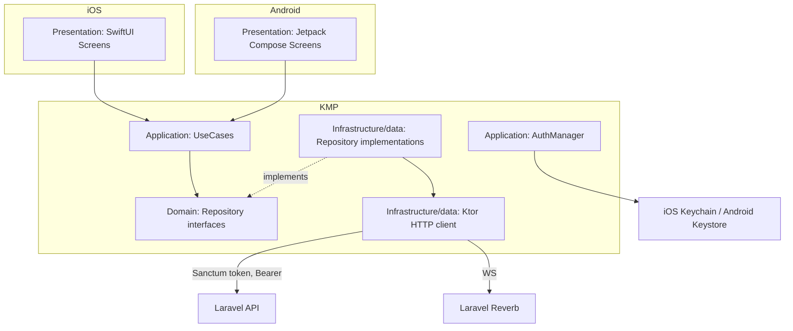

# Mobile App (Consumer) Design

**Spec**: `.specs/features/mobile-app/spec.md`
**Status**: Draft

---

## Architecture Overview

Kotlin Multiplatform (KMP) shared module for networking/business logic, with fully native UI — SwiftUI on iOS, Jetpack Compose on Android (AD-004). Talks to the same Laravel API and the same `consumer` Sanctum guard as `web-app`, sharing the identical `User`/`Favorite`/`Friendship`/`EventInterest`/`Notification` data model documented in `web-app/design.md` — this doc does not redefine those entities, only the mobile-specific client architecture.

- **Layering (AD-012, Clean Architecture)**: `shared/src/commonMain/kotlin/domain/{entities,repositories}` (plain Kotlin entities + repository *interfaces*, no Ktor dependency) → `shared/src/commonMain/kotlin/application/usecases/` (use-case classes, e.g. `ListEventsUseCase`, `LoginUseCase` — native screens call these, never repositories directly) → `shared/src/commonMain/kotlin/data/{network,repositoryimpl}` (Ktor client + concrete repository implementations, today's `EventRepository.kt`/`AuthManager.kt` content split into interface+impl here) → native `Presentation` (SwiftUI/Compose screens, calling Application use-cases only).
- **Shared layer**: Domain, Application, and Infrastructure(data) all live in the KMP `shared` module — one implementation, two native consumers.
- **Native layer**: SwiftUI (iOS) and Jetpack Compose (Android) each own their own screens/state management (e.g. `@StateObject`/`ObservableObject` vs `ViewModel`/`StateFlow`), calling into the shared Application-layer use-cases — no shared UI code, per AD-004, and no direct repository/network access from Presentation.
- **Auth/session**: Sanctum personal-access token issued at login, stored via `AuthManager` in iOS Keychain / Android Keystore (AD-008) — never in `UserDefaults`/`SharedPreferences` plaintext, never in the KMP module's in-memory-only cache without a secure-storage backing.
- **Real-time**: subscribes to the same Reverb `events` channel as web-app for the 60-second listing-freshness requirement (MOBILE-02).

---

## Code Reuse Analysis

### Existing Components to Leverage

| Component | Location | How to Use |
| --- | --- | --- |
| Consumer data model (`User`, `Favorite`, `Friendship`, `EventInterest`, `Notification`) | `web-app/design.md` | Same backend schema, same API contracts — the KMP DTOs mirror these 1:1, no separate mobile schema |
| `AuthController` (OAuth + email/password) | `admin-panel/design.md`'s sibling, `web-app/design.md`'s `AuthController` | Same `consumer` guard endpoints; mobile issues a Sanctum token instead of receiving a cookie |
| Data export/deletion flow (WEB-24/25) | `web-app/design.md`'s `ProfilePage` | Mobile deep-links (opens the web flow in an in-app browser/Custom Tab) per MOBILE-24 rather than reimplementing natively |

---

## Components

### shared/network/EventRepository (KMP)

- **Purpose**: Fetch/paginate the event listing, subscribe to real-time updates, fetch event details (MOBILE-01..09).
- **Location**: `mobile/shared/src/commonMain/kotlin/domain/repositories/EventRepository.kt` (Domain, interface) + `mobile/shared/src/commonMain/kotlin/application/usecases/{ListEventsUseCase,GetEventDetailsUseCase,SubscribeToEventUpdatesUseCase}.kt` (Application) + `mobile/shared/src/commonMain/kotlin/data/repositoryimpl/EventRepositoryImpl.kt` + `mobile/shared/src/commonMain/kotlin/data/network/EventApiClient.kt` (Infrastructure/data)
- **Interfaces**: `suspend fun listEvents(page: Int): List<Event>`, `fun subscribeToEventUpdates(): Flow<EventUpdate>`
- **Dependencies**: Ktor client, Reverb WS client (via a Kotlin WebSocket library compatible with KMP's iOS/Android targets).

### shared/auth/AuthManager (KMP)

- **Purpose**: Login (OAuth + email/password), signup with consent capture (MOBILE-22), token storage/refresh, logout.
- **Location**: `mobile/shared/src/commonMain/kotlin/application/AuthManager.kt` (Application, orchestrates login/signup/logout use-cases) + `mobile/shared/src/commonMain/kotlin/domain/repositories/AuthRepository.kt` (Domain, interface) + `mobile/shared/src/commonMain/kotlin/data/repositoryimpl/AuthRepositoryImpl.kt` (Infrastructure/data, wraps the platform `expect`/`actual` KeychainTokenStore/KeystoreTokenStore)
- **Interfaces**: `suspend fun login(...)`, `suspend fun signup(consentGiven: Boolean, ...)`, `suspend fun logout()`
- **Dependencies**: platform-specific secure-storage implementations via `expect`/`actual` (`KeychainTokenStore` on iOS, `KeystoreTokenStore` on Android).

### iOS: EventListView / EventDetailView (SwiftUI)

- **Purpose**: Native iOS screens for the discovery-to-ticket loop, backed by `EventRepository`.
- **Location**: `mobile/iosApp/Views/Event/` (Presentation only - calls `ListEventsUseCase`/`GetEventDetailsUseCase`, never `EventRepository` directly)

### Android: EventListScreen / EventDetailScreen (Jetpack Compose)

- **Purpose**: Native Android equivalents.
- **Location**: `mobile/androidApp/src/main/kotlin/ui/event/` (Presentation only - calls `ListEventsUseCase`/`GetEventDetailsUseCase`, never `EventRepository` directly)

### Embedded map element (MOBILE-12)

- **Purpose**: Google Maps embedded inside the event details screen (not a standalone map screen), per the spec's Assumptions.
- **Location**: iOS — `GoogleMaps` SDK view wrapped for SwiftUI; Android — Compose Maps.
- **Dependencies**: Google Maps Platform (AD-004); consumes the same cached lat/lng on the `Event` row that `web-app/design.md` documents.

---

## Data Models

No new entities — this feature consumes the `User`, `Favorite`, `Friendship`, `EventInterest`, `Notification`, and `Event` models defined in `web-app/design.md` and `admin-panel/design.md`. The KMP `shared` module's DTOs are a 1:1 Kotlin mirror of those API contracts, not a separate model.

---

## Error Handling Strategy

| Error Scenario | Handling | User Impact |
| --- | --- | --- |
| OAuth provider fails/cancels | Return to login screen with a visible, non-blocking error | Consistent with web-app's equivalent |
| External ticket link fails to open | Inline error, stay on event details screen | Same UX contract as web-app |
| Network unreachable during listing fetch | Show cached last-known listing (if any) with a stale-data indicator, retry on reconnect | Avoids a blank screen on flaky mobile networks |
| Location permission denied | Fall back to manually-entered primary address | Per spec Edge Cases |

---

## Risks & Concerns

| Concern | Location | Impact | Mitigation |
| --- | --- | --- | --- |
| KMP WebSocket support for Reverb across both iOS and Android targets is less battle-tested than plain HTTP | `EventRepository.subscribeToEventUpdates` | Real-time channel could behave inconsistently per-platform | Fall back to a 60s polling timer if the WS connection drops, satisfying MOBILE-02's "within 60 seconds" AC either way — WS is an optimization, polling is the guaranteed floor |
| Two native UI codebases (SwiftUI + Compose) duplicate screen-level logic that a shared UI framework (e.g. Compose Multiplatform) could have avoided | iOS/Android screen layers | More UI code to keep in sync feature-for-feature with web-app | Accepted per AD-004's explicit "native UI" choice — flagged here only for visibility, not something Design should silently work around |

---

## Tech Decisions

| Decision | Choice | Rationale |
| --- | --- | --- |
| Real-time fallback | Poll every 60s if the Reverb WS connection isn't active | Guarantees the spec's freshness AC regardless of WS reliability across platforms |
| Token storage | `expect`/`actual` KMP pattern with Keychain (iOS) / Keystore (Android) backends | Single shared interface, platform-correct secure storage, satisfies AD-008 |
| Data export/deletion UI | Deep-link to the web flow (in-app browser) rather than a native reimplementation | Avoids duplicating LGPD-sensitive logic across three UI codebases (React, SwiftUI, Compose); one implementation to keep compliant |
| Application ID (AD-016) | `br.com.qualorock` for both Android `applicationId` (`androidApp/build.gradle.kts`) and the iOS bundle identifier | Explicit user decision this session - one consistent reverse-DNS identity across platforms |
| Test-tag storage (AD-015) | Android: every Compose `testTag` string is a named resource in one `strings-test.xml`; iOS: every accessibility-identifier constant is in one `TestTags.swift` | Explicit user decision this session - avoids scattered/duplicated test-identifier literals across screens; iOS gets its own idiomatic file since it has no XML strings mechanism |

---

## Coding Conventions (AD-012, AD-013)

- **Clean Architecture, 4 layers**: per the Layering bullet in Architecture Overview - `domain` → `application` → `data` (Infrastructure) in the KMP shared module, with native iOS/Android UI as Presentation-only.
- **No magic numbers/strings**: the 60-second real-time polling interval, the default 10km search radius, and every status/enum string are named constants in `shared/src/commonMain/kotlin/domain/constants/MobileConstants.kt` - never inlined in a use-case or repository.
- **One class per file** across Kotlin (shared module + Android) and Swift (iOS).
- **YAGNI**: only the use-cases/screens named in this document are built - no speculative abstraction beyond what MOBILE-01..24 requires.
- **No task/ticket-referencing comments in code** (AD-014) - rationale lives in this `design.md` and `docs/mobile/architecture.md`.
- **Test tags** (AD-015): Android screens reference `R.string.*` values from `androidApp/src/main/res/values/strings-test.xml` when calling `Modifier.testTag(...)`; iOS views reference constants from `iosApp/Support/TestTags.swift` when setting `.accessibilityIdentifier(...)`. No inline string literals for either.
- **Application ID** (AD-016): `br.com.qualorock` on both platforms, set once in `androidApp/build.gradle.kts` and the Xcode project - never duplicated as a literal elsewhere.

## Documentation (AD-014)

`docs/mobile/architecture.md` is the canonical, human-readable write-up of this feature's layering and conventions, maintained during Tasks/Execute.

---

## Test Plan (AD-010)

- **Shared (kotlin.test)**: `EventRepository` pagination/subscription logic, `AuthManager` token lifecycle (login/refresh/logout), consent-flag plumbing on signup.
- **iOS (XCTest)**: `EventListView`/`EventDetailView` rendering and interaction tests.
- **Android (Compose UI tests)**: equivalent Compose screen tests.
- **E2E (Playwright, web-only legs)**: the deep-link handoff to the web data-export/deletion flow is covered by `web-app`'s E2E suite; mobile-side only tests that the deep link is triggered correctly.
- **Coverage gate**: ≥80% on the shared KMP module per AD-010/AD-011; platform UI test coverage tracked separately per CI job.
