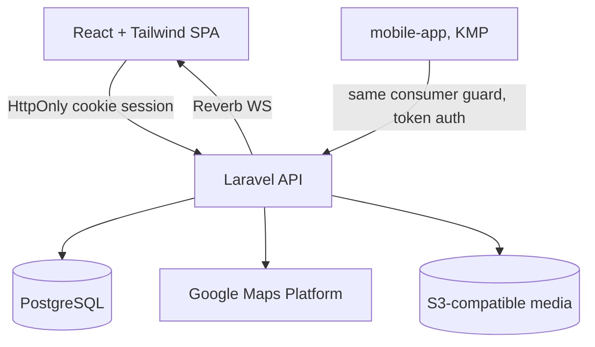

# Web App (Consumer, Desktop) Design

**Spec**: `.specs/features/web-app/spec.md`
**Status**: Draft

---

## Architecture Overview

React + Tailwind SPA on the `consumer` Sanctum guard, sharing its account/session model with `mobile-app` (WEB-13 — same `User` row, same favorites/friends/preferences). This feature owns the **consumer-facing data-rights UI** (export/deletion, WEB-24/25) per AD-008's "avoid duplicating a shared-account capability across two specs" decision — `mobile-app` deep-links here rather than re-implementing it.



- **Auth**: Laravel Sanctum, `consumer` guard. Web sessions ride an HttpOnly/Secure/SameSite cookie (AD-008); the KMP mobile client authenticates against the same guard via a Sanctum personal-access token stored in Keychain/Keystore — same backend user, two token delivery mechanisms.
- **Real-time**: subscribes to the `events` Reverb channel (same one `admin-panel` publishes to) for the 60-second listing-freshness requirement (WEB-02).
- **Social/notification data is written by both consumer clients** (mobile and web) against the same API — no platform-specific backend logic; only the UI differs.
- **Layering (AD-012, Clean Architecture)**: backend follows the same 4-layer split as admin-panel — `Domain/{Entities,Contracts}` → `Application/{UseCases,Services,Policies}` → `Infrastructure/Persistence/Eloquent` → `Presentation/Http/Controllers`. The `website` React SPA mirrors it: `src/domain/{entities,constants,repositories}` (types, named constants, repository interfaces) → `src/application/useCases/` (hooks orchestrating domain + infrastructure) → `src/infrastructure/api/` (the actual fetch/axios calls) → `src/presentation/{pages,components}` (pure UI, no direct API calls).

---

## Data Models

```typescript
interface User {
  id: string
  username: string
  email: string
  phone: string | null
  photoUrl: string | null
  primaryAddress: string | null
  searchRadiusKm: number      // default 10
  favoriteEventTypes: string[]
  pushEnabled: boolean
  pushScopeFilter: "all" | "favorited_and_friends"
  authProvider: "instagram" | "facebook" | "google" | "email"
  validated: boolean            // FR-ACC-05 gate — blocks event/social/notification screens until true
  consentGivenAt: Date           // AD-008, WEB-22/MOBILE-22
  createdAt: Date
  deletedAt: Date | null         // LGPD soft-delete marker
}

interface Favorite {
  userId: string      // FK -> User
  eventId: string      // FK -> Event (owned by admin-panel's schema)
  createdAt: Date
}

interface Friendship {
  userId: string
  friendId: string
  status: "pending" | "accepted"
}

interface EventInterest {
  userId: string
  eventId: string
  markedAt: Date
}

interface Notification {
  id: string
  userId: string
  category: "urgent" | "batch_pricing" | "friends" | "new_event" | "reminder"
  read: boolean
  muted: boolean          // per-alert mute, not channel-wide
  payload: Record<string, unknown>   // deep-link target data (event id, friend id, etc.)
  createdAt: Date
}

interface DataExportRequest {
  id: string
  userId: string
  status: "pending" | "ready" | "failed"
  downloadUrl: string | null
  requestedAt: Date
}
```

**Relationships**: `User` is the canonical consumer identity shared with `mobile-app`. `Favorite`/`EventInterest` reference `Event` rows owned by `admin-panel`'s schema — read-only from this feature's perspective. `Friendship` is a self-referencing pair with a status, queried both directions for "friends list."

---

## Components

### AuthController (shared consumer guard)

- **Purpose**: OAuth (Instagram/Facebook/Google) + email/password login, signup, password recovery, session management (WEB-10..13, consent capture WEB-22).
- **Location**: `backend/app/Presentation/Http/Controllers/Consumer/AuthController.php` (Presentation) → `backend/app/Application/UseCases/Auth/{LoginWithOAuth,LoginWithPassword,Signup,RequestPasswordRecovery}.php` (Application) → `backend/app/Domain/Contracts/UserRepositoryInterface.php` (Domain) implemented by `backend/app/Infrastructure/Persistence/Eloquent/EloquentUserRepository.php` (Infrastructure)
- **Interfaces**: `POST /auth/oauth/{provider}/callback`, `POST /auth/login`, `POST /auth/signup`, `POST /auth/password-recovery`
- **Dependencies**: Socialite (Laravel's standard OAuth package) for the three providers; consent checkbox required server-side, not just client-side, before account creation completes.

### EventListingPage / EventDetailsPage

- **Purpose**: Live, ranked event listing and details (WEB-01..09).
- **Location**: `website/src/presentation/pages/{EventListing,EventDetails}.tsx` (Presentation) → `website/src/application/useCases/{useEventListing,useEventDetails}.ts` (Application) → `website/src/infrastructure/api/EventApiRepository.ts` (Infrastructure) implementing `website/src/domain/repositories/EventRepository.ts` (Domain)
- **Dependencies**: subscribes to Reverb's `events` channel; ranking uses `User.primaryAddress` + `searchRadiusKm` against `Event.location` (geocoded via Google Maps at event-creation time in admin-panel, cached lat/lng on the `Event` row — avoids a geocode call per listing request).

### ProfilePage

- **Purpose**: Profile editing, preferences, favorites management, and the LGPD data-rights UI (WEB-14..18, WEB-23..25).
- **Location**: `website/src/presentation/pages/Profile.tsx` (Presentation) → `website/src/application/useCases/{useUpdateProfile,useFavorites,useDataRights}.ts` (Application) → `website/src/infrastructure/api/{ProfileApiRepository,DataRightsApiRepository}.ts` (Infrastructure) implementing `website/src/domain/repositories/{ProfileRepository,DataRightsRepository}.ts` (Domain)
- **Interfaces**: `PUT /consumer/profile`, `GET /consumer/favorites`, `DELETE /consumer/favorites/{eventId}`, `POST /consumer/data-export`, `POST /consumer/account/delete`
- **Dependencies**: `DataExportJob` (Laravel Queue) generating a downloadable archive of `User`, `Favorite`, `Friendship`, `EventInterest`, `Notification` rows.

### SocialFeedPage

- **Purpose**: Friends list, suggestions, shared interest, activity feed (WEB-17/18).
- **Location**: `website/src/presentation/pages/SocialFeed.tsx` (Presentation) → `website/src/application/useCases/useSocialFeed.ts` (Application) → `website/src/infrastructure/api/SocialApiRepository.ts` (Infrastructure) implementing `website/src/domain/repositories/SocialRepository.ts` (Domain)

### NotificationsPage

- **Purpose**: Filterable notification list with per-item actions, bulk clear/undo, push-channel toggle (WEB-19/20).
- **Location**: `website/src/presentation/pages/Notifications.tsx` (Presentation) → `website/src/application/useCases/useNotifications.ts` (Application) → `website/src/infrastructure/api/NotificationApiRepository.ts` (Infrastructure) implementing `website/src/domain/repositories/NotificationRepository.ts` (Domain)
- **Dependencies**: "clear all + undo" implemented as a soft-delete with a client-held undo window (e.g. 10s), not a hard delete on click.

---

## Error Handling Strategy

| Error Scenario | Handling | User Impact |
| --- | --- | --- |
| Invalid email/password | Generic "invalid credentials" (not field-specific, per WEB-10 AC3) | Single error message, no username/password enumeration hint |
| OAuth provider fails/cancels | Redirect back to login with a non-blocking inline error | User can retry immediately |
| External ticket link fails to open | Inline error, stay on event details page | No dead-end navigation |
| Unvalidated account navigates to a gated route | Route guard redirects to the validation flow | Consistent block, no partial access leak |
| Account deletion requested with unresolved state (e.g. pending friend request) | 409 warning-required response | Confirmation modal before proceeding |

---

## Risks & Concerns

| Concern | Location | Impact | Mitigation |
| --- | --- | --- | --- |
| Geocoding every event at creation time couples admin-panel to Google Maps availability | `admin-panel`'s event-create flow, consumed here for ranking | If geocoding fails, an event could be missing lat/lng and drop out of "nearby" ranking silently | Store the raw address regardless of geocode success; fall back to text-only display (no map pin) rather than hiding the event, and retry geocoding via a queued job |
| Shared `User` row across two clients (web + mobile) means a profile edit race (edit same field on both simultaneously) is possible | `ProfilePage` / mobile equivalent | Last-write-wins could silently drop one device's edit | Acceptable for this pass (low-likelihood, low-severity); flag as a known limitation rather than building optimistic-lock/merge UI not requested |
| Cookie-based web session + token-based mobile session on the same guard needs care in Sanctum config | `AuthController`, Sanctum config | Misconfiguration could allow session fixation or CSRF gaps on the cookie side | Enable Sanctum's stateful-domain CSRF protection for the web app specifically; mobile's token auth is stateless and unaffected |

---

## Tech Decisions

| Decision | Choice | Rationale |
| --- | --- | --- |
| Event geolocation | Lat/lng cached on the `Event` row at creation time (admin-panel), not geocoded per listing request | Avoids per-request Google Maps API cost/latency on the high-traffic listing endpoint |
| Notification "clear all" semantics | Soft-delete with a client-side undo window | Matches the spec's explicit undo requirement (WEB-20 AC5) without needing server-side undo state |
| Data export format | A downloadable JSON archive (queued job, emailed/linked when ready) | Simple, machine-readable, sufficient for LGPD access-right compliance without building a UI-rendered report |

---

## Coding Conventions (AD-012, AD-013)

- **Clean Architecture, 4 layers**: backend and the `website` React SPA both follow Presentation → Application → Domain ← Infrastructure, per the Layering bullet above.
- **No magic numbers/strings**: the default search radius (`10`km), the notification clear-all undo window (seconds), and every status/enum string (`authProvider` values, `pushScopeFilter` values, notification `category` values) are named constants in `backend/app/Domain/Constants/WebAppConstants.php` and `website/src/domain/constants/webAppConstants.ts` — never inlined.
- **One class per file** across PHP and TypeScript/TSX in this feature.
- **YAGNI**: only the use-cases/endpoints named in this document are built.
- **No task/ticket-referencing comments in code** (AD-014) — rationale lives in this `design.md` and `docs/web-app/architecture.md`.

## Documentation (AD-014)

`docs/web-app/architecture.md` is the canonical, human-readable write-up of this feature's layering and conventions, maintained during Tasks/Execute.

---

## Test Plan (AD-010)

- **Backend (Pest)**: auth flows (OAuth mock, email/password, invalid-credentials generic error), favorites/friends/notifications CRUD, data export/deletion feature tests.
- **Web (Jest/RTL)**: `ProfilePage`, `NotificationsPage` (filter tabs, mute, clear+undo), `EventListingPage` (real-time update rendering).
- **E2E (Playwright)**: GIVEN a validated user WHEN they favorite an event THEN it appears in the favorites list and syncs to a mobile-session equivalent check (cross-platform account-sharing test, WEB-13); full data-export-then-deletion flow.
- **Coverage gate**: ≥80% per AD-010/AD-011.
